# Iterative Closest Point (ICP)

Iterative Closest Point is a point cloud registration algorithm, typically 
used to align two point clouds in 3-dimensional space. One common use case 
for ICP is in a retrieval based localization system, where it serves as 
the core matching tool.

The following repository contains several hardware-aware implementations 
of the ICP algorithm, providing a detailed breakdown of each step with the 
overall vision of creating a custom SoC. This SoC will leverage the 
[DRRA-2](https://silago.eecs.kth.se/docs/Docs/Fabric/DRRA/v2/Overview/) 
fabric to accelerate each iteration of the ICP algorithm and will 
integrate a RISC-V processor to handle general-purpose computation tasks.

## Contents
[Point-to-point ICP - 2D](#point-to-point-icp---2d)  
[Point-to-point ICP - 3D](#point-to-point-icp---3d)  
[k-Dimensional Tree](#k-dimensional-tree)  
[References](#references)

## Point-to-point ICP - 2D

First we will start with a 2-dimensional point cloud, generated as a sum of 
randomized decaying harmonics producing a natural looking irregular waveform 
shown below.

Next, we generate a random transformation and apply it to the point cloud, 
adding gaussian noise to simulate a real time scan from a time-of-flight sensor.

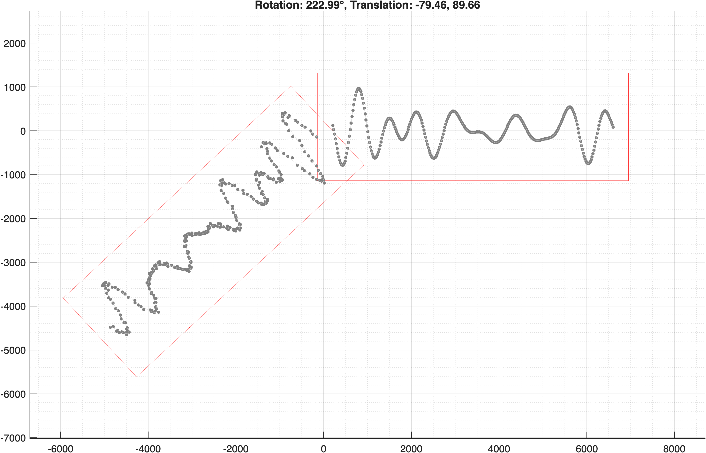

Now we can begin the ICP algorithm with the input to the first iteration 
shown below.

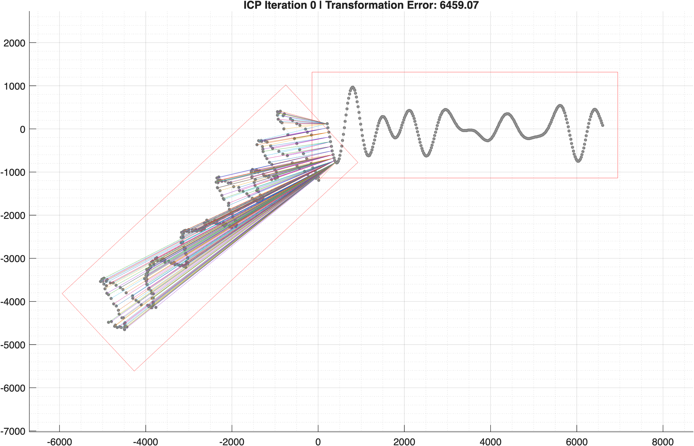

After 5 iterations, we have the following.

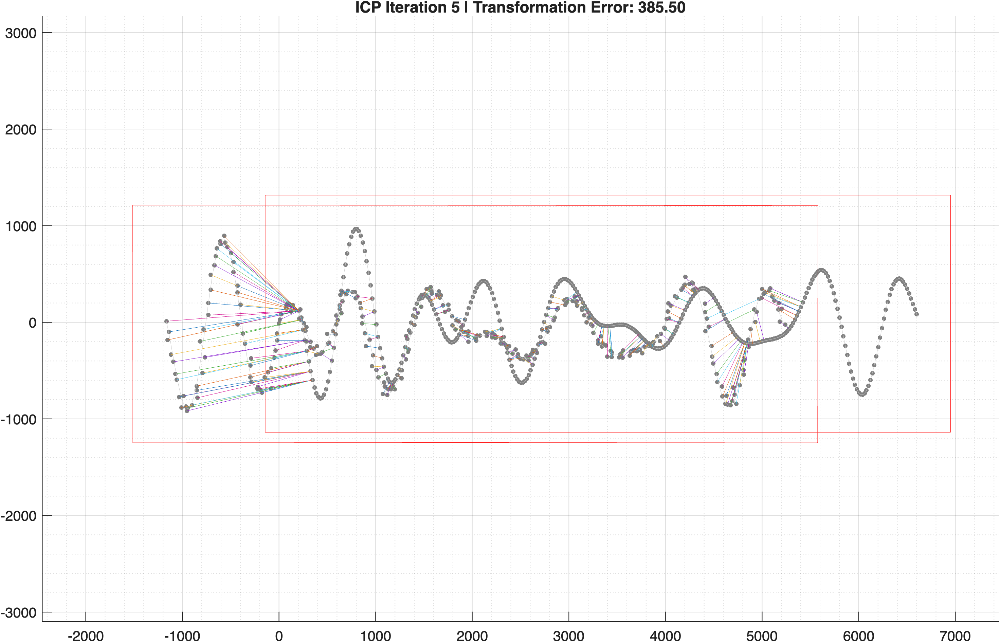

With convergence after 32 iterations as shown.

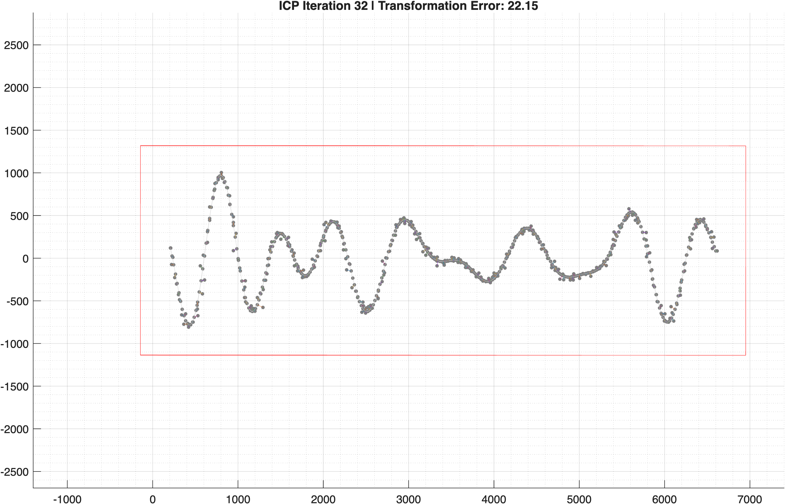

It should be noted that convergence to the global minimum is not 
guaranteed, with longer waveforms increasing the likelihood of getting 
trapped in local minima.

## Point-to-point ICP - 3D

First, we begin with a 3-dimensional point cloud; a stochastically generated
2D surface. This surface is constructed as the outer product of two 
horizontal signals, each formed by a randomized, decaying harmonic series.

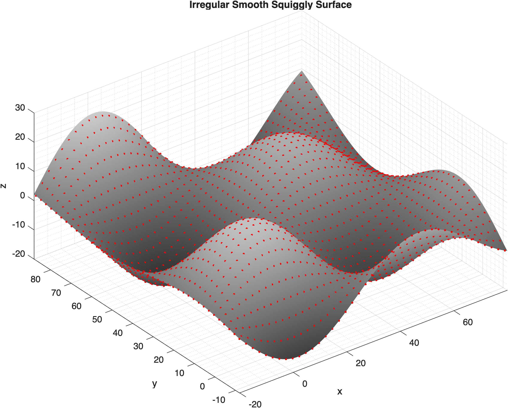

As we did in the 2-dimensional case, we can now generate a random 
transformation and apply it to the point cloud, once again, adding gaussian 
noise to simulate a real time scan from a time-of-flight sensor.

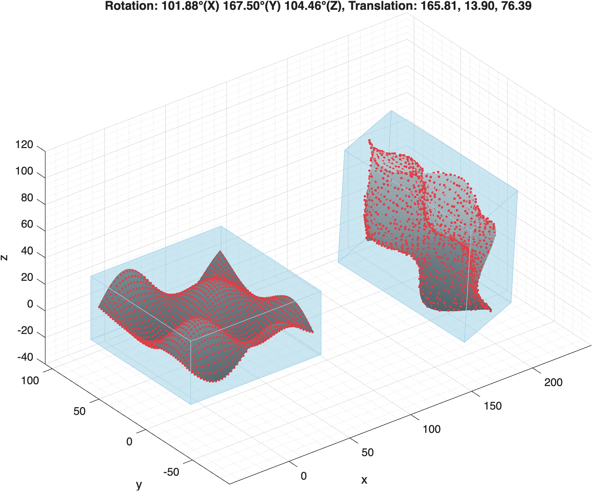

Below, you can see the input to the ICP algorithm, and the status after 5 
iterations, and finally, the point clouds after convergence at 26 iterations.

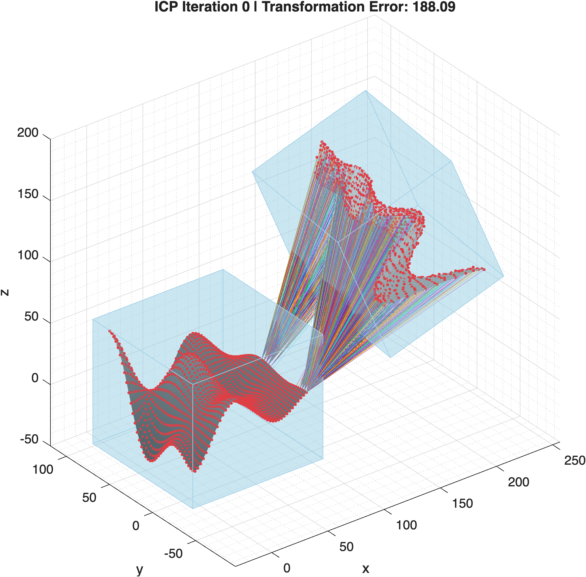

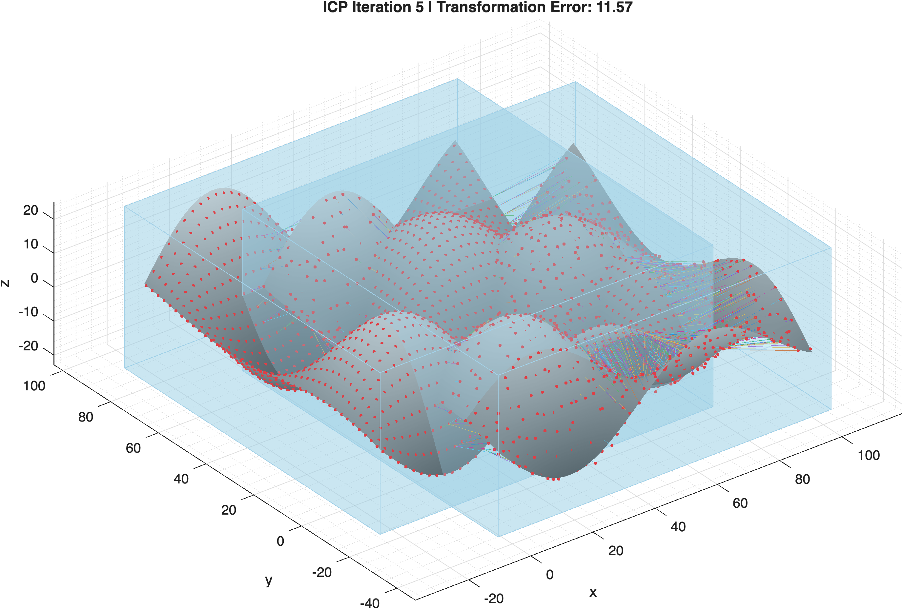

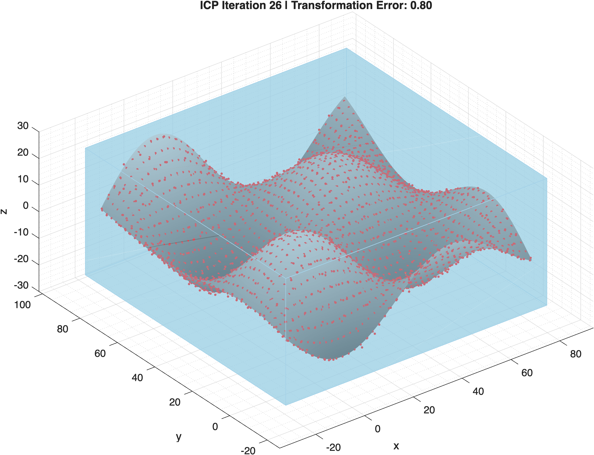

## k-Dimensional Tree

Besides the linear algebra for each ICP iteration, the most significant 
computational burden comes from determining the nearest point in Q (reference 
point cloud) for each point in P (input point cloud undergoing transformation).

To outline how to create and use a k-Dimensional tree, we will first start with 
an example of 10 points where each coordinate is a random value between 1 and 
100 (inclusive).

The first step in constructing a k-D tree is to iteratively split the point 
cloud at the median point along alternating axes, continuing until only leaf 
nodes remain.

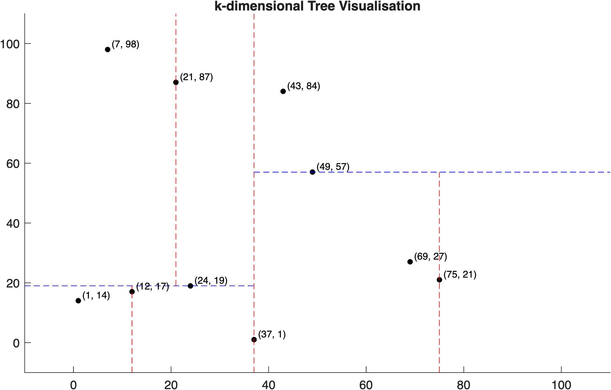

To enable efficient traversal of the tree, for each node, we must store the 
following.

- the current point
- the axis along which the point cloud was split
- the point on the left branch (empty if none)
- the point on the right branch (empty if none)

Having done this, we can draw the tree as shown.

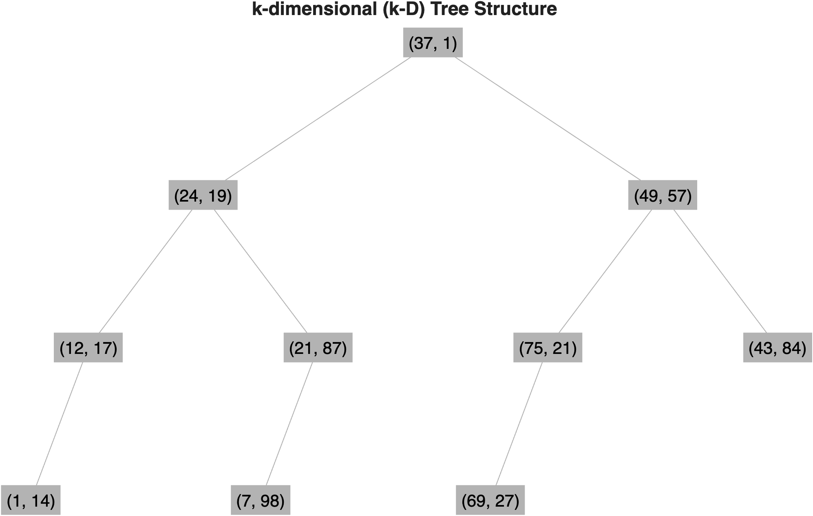

Consider a query point (shown in red) for which we want to find the nearest point 
using the tree constructed above.

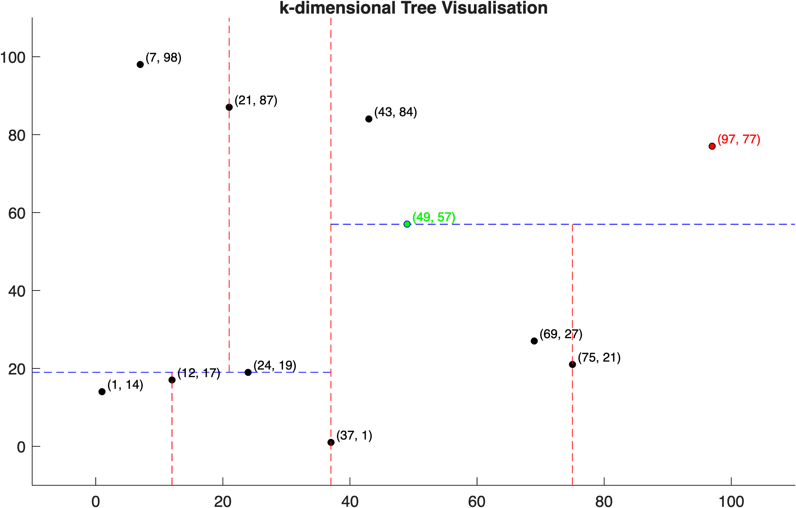

The process of identifying the nearest point always begins at the root of the 
k-D tree which is then recursively traversed down to a leaf node by comparing 
coordinates along the current splitting axis. At each node, we follow the near 
branch, the side where the query lies, but also check whether the far branch 
may contain a closer point. If the query's distance to the splitting plane is 
less than the current best distance, we explore the far branch as well, 
ensuring points near partition boundaries are not missed.

The nearest point is shown above in green.

## References

The following references provide good intuition on which these 
implementations are based.

[Iterative Closest Point (ICP) - Computerphile](https://www.youtube.com/watch?v=4uWSo8v3iQA)  
[K-d Trees - Computerphile](https://www.youtube.com/watch?v=BK5x7IUTIyU)

## License

This project is licensed under the [MIT License](LICENSE).